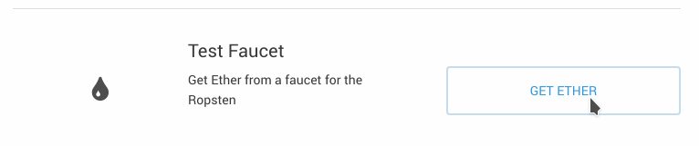
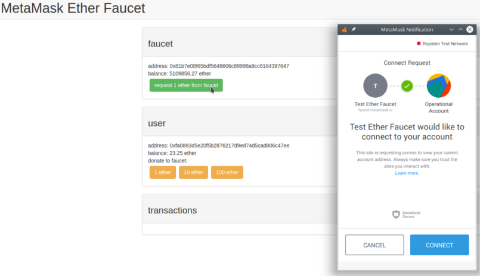
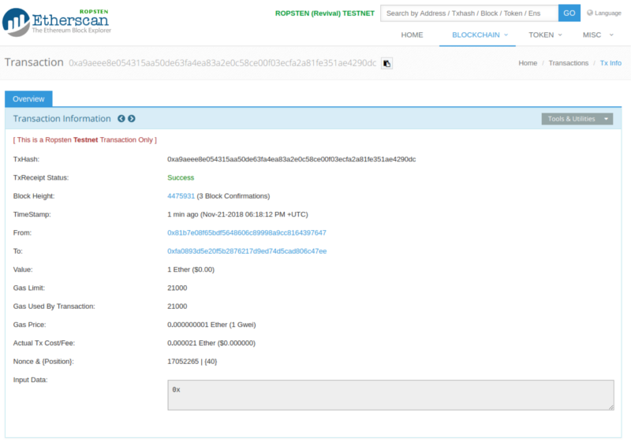
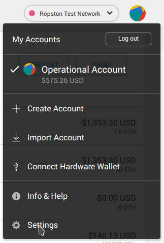
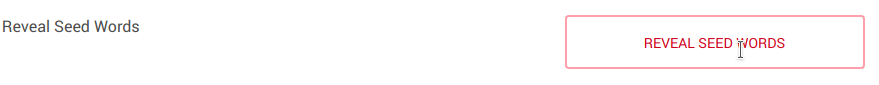
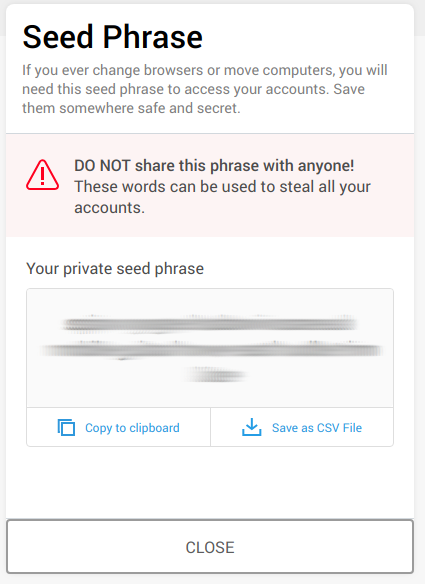

# ICT Ministry's Digital Innovation Center Blockchain Toolkit SmartContracts

Welcome to the Blockchain Toolkit API. This is the documentation for developers to start using this toolkit SmartContracts.

## Local Deployment
In order to allow the API project to run locally, you must have `ganache-cli` and `truffle` globally installed.

```bash
npm i -g ganache-cli truffle
```

In a fully dedicated terminal run the virtual local blockchain:

```bash
ganache-cli
```

Then in another fully dedicated terminal compile and migrate the SmartContracts into the blockchain

```bash
truffle compile && truffle migrate
```

Just let `ganache-cli`'s blockchain run while you use the API project.

## Public Testing Network (Ropsten) Deployment

### Getting a new Ethereum Account
Before using any of Ethereum's networks you must guarantee having an account with enough balance to play with.

#### Metamask
In order to get an account, you can use [Metamask](https://metamask.io/). Once the plugin is installed, follow the instructions to create your account.

Using the Metamask plugin, ensure you are connected to the Ropsten network.


If you lack funds, you can deposit using the Ropsten Faucet. Just click on Deposit, and then use the faucet.



Then click on the green button. A pop up dialog will ask for your permission to connect to the faucet. Simply confirm.



A new transaction will appear at the transaction section. If you click it, you will see the transaction state on [Ropsten Etherscan](https://ropsten.etherscan.io/tx/0xa9aeee8e054315aa50de63fa4ea83a2e0c58ce00f03ecfa2a81fe351ae4290dc).



### INFURA
The only way to connect to any of the Ethereum networks is having an Ethereum node. You might install one, and connect to it. However, you can skip that using [INFURA](https://infura.io/).

With INFURA, you only need to create an account. You will get an API key useful for any Ethereum Network based on a custom project.

### Environment
In order to let `truffle` connect to the Ropsten network, you must create a file named `.env` ensuring the following data.
 
```
mnemonic=twist exclude custom cactus hole ocean double defense near cannon flame school
apikey=020a58dd574648e0a0b88f06ce5d963
host=https://ropsten.infura.io
```
1. `mnemonic`: Words set generated by Metamask when creating the account. It's expected of you to have saved those words on a secure form. However check the [recovering words](#recovering-words-section) section if you happened to lost them.
1. `apikey`: API key gotten from [INFURA](#infura)
1. `host`: Indicates the INFURA's Ropsten network endpoint.

### Recovering Words Section
Click on the avatar image on Metamask, then on Settings.



Then click on the Reveal Seed Words button. You will have to provide your password.





### Connecting to Ropsten Using `truffle` Console
To deploy the contract into Ropsten's blockchain use:

```bash
truffle console --network ropsten
```

The command will use the identifier set on the `truffle.js` file (i.e. ropsten).

Once on the `truffle` console, compile and migrate the SmartContracts.

```JavaScript
> compile
> migrate
```

If you want to re-deploy the contracts, on the `truffle` console type:

```JavaScript
> migrate --reset
```

The `migrate` command will show you the address where the SmartContract was deployed, however, if you are not sure about the address the contract was deployed, you can type on the `truffle` console:

```JavaScript
> Toolkit.address
```

**Having that address is important** because it will live inside the API's `.env` file.